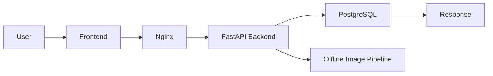

# Graphlish

AI-powered vocabulary learning system that maps English words to real-world visual concepts through image retrieval, filtering, and ranking.

## ⚠️ Note

This repository contains an earlier Java-based prototype of Graphlish.

The current version of Graphlish has been fully redesigned and implemented in Python with a production-oriented architecture (AWS, Docker, Nginx, PostgreSQL, AI pipeline).

Due to ongoing development, the latest version is maintained in a private repository.  
This README reflects the architecture and design of the current system.

## Overview

Graphlish is a visual vocabulary learning system designed to help learners understand English words through high-quality real-world images rather than long dictionary-style definitions.

Given a word query, Graphlish retrieves candidate images from external sources, applies multi-stage filtering and uses AI-based scoring to evaluate semantic relevance, visual clarity, and other quality signals for ranking. The system then returns a small set of high-signal images that best represent the target word.

The current version is deployed on AWS and supports end-to-end interaction through a simple web interface.

## 📸 Example Output

User query: "apple"

The system retrieves ~50 candidate images and returns the top-ranked results based on semantic relevance, clarity, and other quality signals.

## Project Status

Graphlish is currently functional as an end-to-end system.

Implemented components include:

- image retrieval from external APIs
- multi-stage filtering pipeline
- ranking system for top-K image selection
- PostgreSQL-based result storage
- AWS deployment with Docker and Nginx
- simple frontend for public access and result visualization

## ⚙️ System Architecture

Graphlish is designed as a pipeline-based system with a separation between **offline processing** and **real-time query serving**, enabling efficient AI usage while maintaining low-latency user experience.

### End-to-End Flow

[//]: # (User → Frontend → Nginx → FastAPI Backend → PostgreSQL → Response  )

[//]: # (                                 ↓  )

[//]: # (                       Offline Image Pipeline)

### 🧩 Core Components

#### Frontend + Gateway

- A lightweight web interface allows users to input vocabulary queries
- Nginx serves as a reverse proxy and handles frontend hosting

#### Backend Service (FastAPI)

- Handles incoming user requests
- Retrieves precomputed results from PostgreSQL
- Returns top-ranked image URLs to the frontend

#### Offline Image Pipeline

The core image processing and AI computation are handled in an offline pipeline to avoid high latency during user queries.

Word → Image Retrieval → Filter Scoring → Candidate Selection → Ranking Scoring → Top-K → Storage

## Image Processing Strategy

Graphlish uses a **two-stage hybrid scoring pipeline** to balance cost, performance, and result quality.

### Stage 1: Filter Scoring (Hybrid Coarse Selection)

- Retrieves ~50 candidate images from external APIs (e.g., Unsplash)
- Applies a **hybrid scoring strategy** combining:
    - rule-based signals (e.g., resolution, aspect ratio, metadata quality)
    - lightweight AI evaluation (for basic semantic relevance and content understanding)
- Produces a coarse score for each image and selects the top 10–20 candidates

This stage reduces noise efficiently while keeping computational cost low.

### Stage 2: Ranking Scoring (Fine-grained AI Evaluation)

- Applies a more advanced AI model to the filtered candidate set
- Performs deeper analysis using multiple signals, including:
    - semantic relevance
    - visual clarity
    - object-level complexity (e.g., number of distractors)
- Produces final scores to rank images and select top-K results (typically 3–5)

This stage focuses on maximizing ranking precision while limiting expensive model usage.

## ⚡ Cold-start / Hot-path Design

To handle the high latency of AI-based processing, Graphlish separates offline computation from online serving:

- **Cold-start (offline batch processing)**:
    - triggered via batch scripts
    - processes vocabulary sets in advance
    - performs full pipeline scoring and ranking

- **Hot-path (online query serving)**:
    - retrieves precomputed results from PostgreSQL
    - returns results with near real-time latency

This design ensures fast user experience while keeping AI processing scalable.

## 🛠️ Deployment

- Hosted on **AWS EC2**
- Backend services containerized with **Docker**
- **Nginx** handles reverse proxy and frontend hosting
- PostgreSQL runs on the server for persistent storage

## Tech Stack

**Backend**
- Python (FastAPI)

**Frontend**
- HTML / JavaScript

**AI Integration**
- LLM APIs for image scoring and evaluation

**Data & Storage**
- PostgreSQL
- Cloudflare R2

**Infrastructure & Deployment**
- AWS EC2
- Docker
- Nginx

**External Services**
- Unsplash API

## 💡 Design Decisions

### Why not real-time AI processing?

AI-based image evaluation is computationally expensive and introduces high latency (several minutes per word in testing).
Performing this process in real time would make the system unusable for end users.

Instead, Graphlish uses an offline pipeline (cold-start) to precompute results, and serves user queries through a fast retrieval path (hot-path).

This design ensures near real-time response while keeping AI computation scalable.

### Why a two-stage scoring pipeline?

Applying advanced AI models to all candidate images would be prohibitively expensive and slow.

Graphlish adopts a two-stage scoring strategy:

-	a lightweight stage for coarse filtering

-	a more advanced stage for fine-grained ranking

This significantly reduces the number of expensive AI calls while maintaining high-quality results.

### Why combine rule-based and AI-based scoring?

Not all evaluation signals require AI.

Basic image properties (e.g., resolution, aspect ratio) can be efficiently handled using rule-based methods, while semantic understanding requires AI models.

By combining both approaches, Graphlish achieves:

-	lower computational cost

-	better performance

-	more controllable ranking behavior

### Why offline batch processing?

The system is designed to process vocabulary sets in batches (via scripts), allowing large-scale precomputation.

This approach:

-	improves throughput

-	enables better resource utilization

-	avoids repeated AI computation for the same inputs

## Design Principles

### Visual Concept Mapping

Graphlish focuses on connecting vocabulary with real-world concepts rather than relying only on textual definitions.  
The goal is to help learners directly associate a word with the object or concept it represents.

### High-Density Learning Signals

Instead of presenting every possible dictionary meaning, Graphlish prioritizes the most common and practical meanings that learners encounter in everyday usage.

This reduces noise and allows learners to quickly grasp the core concept of a word.

### Reduce Translation Thinking

By mapping words directly to visual concepts, Graphlish aims to reduce the need for mental translation into a learner's native language.

## Future Work

Planned improvements include:

- CLIP / embedding-based ranking experiments
- improved object-level scoring and ambiguity detection
- Redis or database-level caching optimization
- better frontend UI/UX
- user personalization and learning history