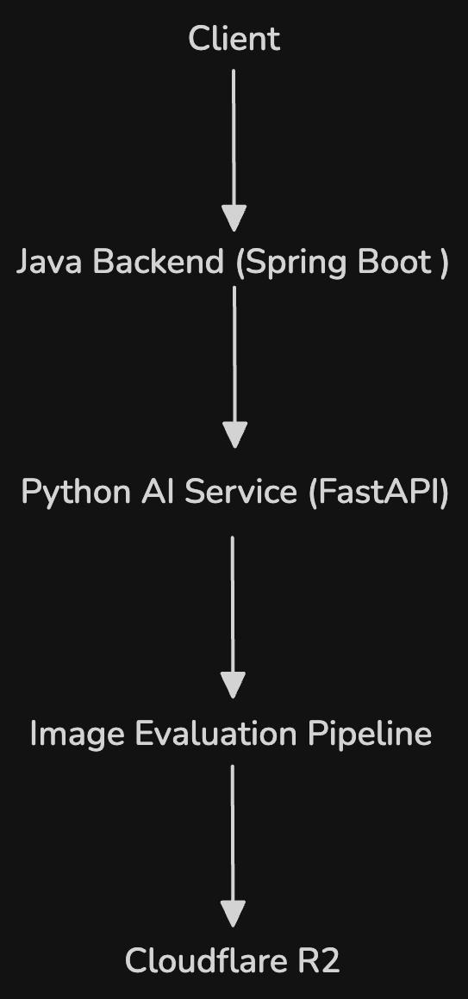

# Graphlish

AI-powered visual vocabulary learning backend that maps words to real-world concepts.

## Intro

Graphlish is an AI-powered vocabulary learning backend project that helps users understand English words through visual concept mapping.

Instead of relying on long dictionary-style definitions, Graphlish focuses on high-density learning signals: a small set of carefully selected images and short explanations that represent how a word is most commonly used in everyday contexts.

The goal is not to list every possible meaning of a word, but to highlight the most frequent and practical meanings so learners can quickly connect a word with the real-world concept it represents, reducing the need for mental translation.

This repository contains the original Java-based prototype of Graphlish. The current version is being expanded into a hybrid Java + Python architecture, where Java acts as the main backend service and Python powers the AI-based image evaluation pipeline.

## Project Status

Graphlish is currently under active development.

The AI evaluation pipeline is implemented and functional, while the image ranking system and full Java backend integration are still in progress.

## System Overview

Graphlish processes a vocabulary query through a multi-stage image evaluation pipeline to identify images that best represent the meaning of a word.

Pipeline overview:

Word Query → Image Retrieval (Unsplash API) → Metadata Parsing → L1 Quality Filter → L2 Semantic Filter → L3 Clarity Evaluation → Ranking → Cloudflare R2 Storage → API Response

## Image Evaluation Pipeline

The Graphlish backend processes candidate images through several evaluation stages to ensure that the final results clearly represent the target word.

### L1 Filter – Basic Image Quality Filtering

The first stage removes obviously unsuitable images based on metadata returned by the image provider.

Examples of filtered cases include:

- Missing image URLs
- Missing width or height metadata
- Extremely unusual aspect ratios
- Very low resolution images

This stage ensures that only technically valid images proceed to semantic evaluation.

---

### L2 Filter – Semantic Relevance Evaluation

In this stage, an AI model evaluates whether the image is semantically related to the queried word.

Each image receives a relevance score indicating how closely the image matches the target word.

Images with low semantic relevance are rejected before entering later stages.

Caching mechanisms are used to avoid repeated AI evaluations for identical image-word pairs.

---

### L3 Evaluation – Visual Clarity Assessment

This stage evaluates how clearly the image represents the target word.

The evaluation considers factors such as:

- Whether the image clearly represents the concept of the word
- Whether it is a typical and recognizable example
- Whether it would help a learner correctly understand the word

The current implementation uses a lightweight model and serves mainly as a coarse filtering stage before ranking.

---

### Ranking Stage (In Development)

The ranking stage will become the core component of the system.

Instead of relying on a single evaluation score, the ranking algorithm will combine multiple signals to determine the best images for each vocabulary query.

Planned ranking signals include:

- semantic relevance
- visual clarity
- typicality of the concept
- ambiguity detection

The goal of this stage is to select a small set of high-signal images that best represent the real-world meaning of the word.

## Architecture

Graphlish follows a service-oriented architecture that separates the main backend service from the AI evaluation pipeline.

Java (Spring Boot) acts as the primary backend service responsible for user-facing APIs, authentication, and system orchestration.

Python (FastAPI) runs the AI image evaluation pipeline and exposes internal APIs that can be called by the Java backend.

The Python service can be independently developed and scaled without affecting the main backend.

### Architecture Diagram

  

The system follows a service-oriented architecture where the Java backend communicates with the Python AI service through internal APIs.

Architecture overview:

Client → Java Backend (Spring Boot) → Python AI Service (FastAPI) → Image Evaluation Pipeline → Cloudflare R2

## Tech Stack

**Backend**
- Java (Spring Boot)
- Python (FastAPI)

**AI Integration**
- LLM APIs (image semantic evaluation)

**Data & Storage**
- Cloudflare R2 (object storage)

**External Services**
- Unsplash API (image retrieval)

## Design Principles

### Visual Concept Mapping

Graphlish focuses on connecting vocabulary with real-world concepts rather than relying only on textual definitions.  
The goal is to help learners directly associate a word with the object or concept it represents.

### High-Density Learning Signals

Instead of presenting every possible dictionary meaning, Graphlish prioritizes the most common and practical meanings that learners encounter in everyday usage.

This reduces noise and allows learners to quickly grasp the core concept of a word.

### Reduce Translation Thinking

By mapping words directly to visual concepts, Graphlish aims to reduce the need for mental translation into a learner's native language.

## Future Work

Planned improvements include:

- Multi-dimensional image ranking system
- Improved ranking algorithms for image selection
- More advanced AI evaluation models
- Improved caching strategies
- Java backend integration with the AI service